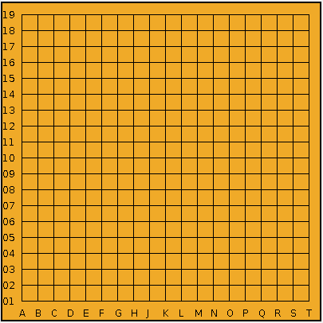

# JAVA API for CONNSIX

## About
This API is for Connect Six programs developed with the Java programming language. Its functions connect and communicate with the single mode server.
 
이 API는 자바 프로그래밍 언어로 개발한 육목 AI를 프로그램들을 위한 API이다. 모든 method들은 싱글 모드 서버와 연결하고 소통하기 위한 기능들이 구현되어있다.

## Coordinate System
The coordinate is consisted with an alphabet character and a number. The columns are notated with `A` ~ `T` with `I` not included. The rows are notated with `01` ~ `19`. The one digit numbers may or may not have a leading 0. To express more than one coordinates, the coordinates should be separated with `:`.
 
바둑판의 좌표는 alphabet character 하나와 숫자로 표기한다. 바둑판의 세로줄은 alphabet `A` 부터 `T` 로 표기하고 이때 `I`는 포함되지 않는다.
가로줄은 숫자 `01` ~ `19`로 표기하며 10 이하의 숫자들은 십의 자리를 0으로 표기해도 안해도된다.
하나의 좌표는 이 두 정보를 합친 String으로 표현해야한다.
여러 좌표들을 표기하기 위해서는 좌표들 사이에 `:`를 넣어 하나의 String으로 만들어야한다.
* Ex) `A01`, `A1`, `B03`, `B3`, `J12`, `A01:E13`, `E11:J18:K10:T19`
 
`Strict notation`: coorinate with leading 0.
* Ex) `A01`, `C04`
 
`Extended notation`: coorinate without leading 0.
* Ex) `A1`, `C4`
 
 
Below is an image that explains the coordinate system.
 
밑의 이미지는 앞서 설명한 좌표 시스템을 나타낸 것이다.
 

## Methods
1. ***public ConnectSix(String ip, int port, String color)***   
Creates an instance of the class ConnectSix and connects to the single mode server.
When success, the field `redStones` will contain the positions of the red stones as a String type.
The positions of the red stones will follow the `strict notation` explained above.
On connection failure, the constructor will throw ConnSixException.
If there is no red stones to begin with, the field `redStones` will contain the null value.
The user must make a instance of the class using this constructor in order to use the single mode server and other methods.   
ConnectSix class의 객체를 만들어주는 동시에 싱글 모드 서버에 연결해준다. 객체를 생성하는 것에 성공하면 `redStones`라는 field 안에 문자열로된 적돌의 좌표를 저장한다.
이때 적돌의 좌표는 위에서 설명한 `strict notation`를 따른다. 객체를 생성하는 것이 실패했을 경우 ConnSixException을 던진다.
적돌이 없는 경우, `redStones`에는 null 값이 들어간다.
사용자는 제일 먼저 이 constructor를 이용해서 class의 객체를 만들어야만 싱글 모드 서버와 연결하고 다른 method들을 사용할 수 있다.
  
__Parameter__
    - `ip`   
    String type that contains the ip information.   
    ip 정보를 가지고 있는 문자열.   
        - Ex) "127.0.0.1"
    - `port`   
    Integer type that contains the port number information.   
    port 정보를 가지고 있는 정수.
        - Ex) 8080
    - `color`   
    String type that contains the color of the stone that the client will be using.   
    사용자가 사용할 돌의 색 정보를 가지고 있는 문자열.
        - `White` `Black`
       
    __Throws__
    - `ConnSixException`   
    Throws an exception that happens when the network connection fail.
    Connection failure can happen because of ip, port information error, underlying protocol error and IOException related to socket creation.   
    네트워크 연결이 실패하면 `ConnSixException` 예외를 던진다. 연결 실패는 잘못된 ip, port 정보, 프로토콜 에러 그리고 socket 생성 관련 IOException 때문에 발생할 수 있다.
   
2. ***public String letsConnect(String ip, int port, String color)***   
Connects to the single mode server and gets the red stones' positions from the single mode server.
This function will be called from the constructor method.
Therefore making an instance of this class will automatically connect to the single mode server by calling this function.   
싱글 모드 서버에 연결해주고 field `redStones`에 적돌의 위치를 넣어준다. 이 method는 constructor에서 부르기 때문에 따로 불러줄 필요가 없다.
  
__Parameter__
    - `ip`   
    String type that contains the ip information.   
    ip 정보를 가지고 있는 문자열.   
        - Ex) "127.0.0.1"
    - `port`   
    Integer type that contains the port number information.   
    port 정보를 가지고 있는 정수.
        - Ex) 8080
    - `color`   
    String type that contains the color of the stone that the client will be using.   
    사용자가 사용할 돌의 색 정보를 가지고 있는 문자열.
        - `White` `Black`   
       
    __Returns__
    - A String that contatins the positions of the red stones. The positions will follow the `strict notation` explained above.   
    적돌의 좌표 정보가 담긴 문자열을 리턴한다. 이 좌표들은 위에서 설명한 `strict notation`을 따른다.   
       
    __Throws__
    - `ConnSixException` Throws an exception that happens when the network connection fail.
    Connection failure can happen because of ip, port information error, underlying protocol error and IOException related to socket creation.   
    네트워크 연결이 실패하면 `ConnSixException` 예외를 던진다. 연결 실패는 잘못된 ip, port 정보, 프로토콜 에러 그리고 socket 생성 관련 IOException 때문에 발생할 수 있다.   

3. ***public String drawAndRead(String draw)***   
Sends the position of the user's next move to the single mode server and returns the opponent's next move.
The first move of black must be "K10" and the first move of white must be "", an empty String.
If the user sends an invalid coordinate, an error message will be sent to the single mode server.
All positions will follow the position notation explained above.   
사용자의 다음 수를 싱글 모드 서버에 보내고 상대방의 다음 수를 리턴한다.
흑돌의 첫 수는 무조건 `K10`이어야하고 백돌의 첫 수는 무조건 빈 문자열이어야한다.
만약 사용자가 유효하지 않은 좌표를 보낸다면 상대방의 다음 수가 아닌 에러 메세지가 리턴될 것이다.
모든 좌표들은 위에서 설명한 좌표 표기법을 따라야한다.
    1. `BADCOORD`
        - The coordinate if out of bounds.   
        범위를 벗어난 좌표일 경우
    2. `NOTEMPTY`
        - The position is already occupied by another stone.   
        비어있지 않은 위치의 좌표일 경우
    3. `BADINPUT`
        - The first move is not `K10` for black or an empty string for white.   
        흑돌의 첫 수가 `K10`이 아니거나 백돌의 첫 수가 빈 문자열이 아닌 경우
        - The moves other than the first move don't hold two positions.   
        첫 수가 아닌데 수를 두개 보내지 않은 경우
        - Any other inputs that doesn't follow the position notation.   
        그 외 좌표 표기법을 따르지 않는 입력일 경우   
           
    __Parameter__   
    - `draw`   
    The position where the user will put their stones.   
    사용자의 다음 수가 표기된 문자열   
       
    __Returns__
    - When the game continues, the position of the opponent's move, expressed in `strict notation`, will be returned.
    When the game is over, the return value will be `WIN`, `LOSE` or `EVEN`.   
    게임이 진행될 경우, `strict noation`로 표기된 상대방의 다음 수를 리턴한다.
    게임이 끝난 경우, 게임 결과에 따라 `WIN`, `LOSE` 혹은 `EVEN`이 리턴된다.   
       
    __Throws__
    - `ConnSixException`   
    Throws an exception when communication with the single mode server failed.   
    싱글 모드 서버와의 통신이 실패했을 경우 예외를 던진다.

4. ***public String getStoneAt(String position)***   
Returns the current state of the position.   
입력으로 보낸 좌표의 현재 상태를 리턴한다.
  
__Parameter__
    - `position`   
    The position of the state that the user is curious about.   
    사용자가 물어보는 상태의 위치 좌표   
       
    __Returns__
    - Returns a String that can be `EMPTY`, `WHITE`, `BLACK` or `RED` according to the state of the position.
    When the position does not follow the position notation, the function will return the null value.   
    좌표의 상태에 따라 `EMPTY`, `WHITE`, `BLACK` 혹은 `RED` 값의 문자열을 리턴한다.
    입력 좌표가 좌표 표기법을 따르지 않는 경우 null 값을 리턴한다.   

## Dummy AI
There is an example that randomly generates 2 coordinates and sends to the single mkode server.
Due to the fact that it just generates coordinates, it may send invalid coordinates and end the game.   
'dummyAi'라는 폴더 안에는 이 API를 사용하는 예시 프로그램이 있다.
이 프로그램은 무작위로 두개의 좌표를 생성해내 API내의 method들을 이용해 싱글 모드 서버에 보낸다.
이때 무작위로 생성하는 두 좌표는 유효한 좌표인지를 확인하지 않기 때문에 유효하지 않은 좌표로 인해 싱글 모드 서버에서 게임을 종료할 수 있다.
